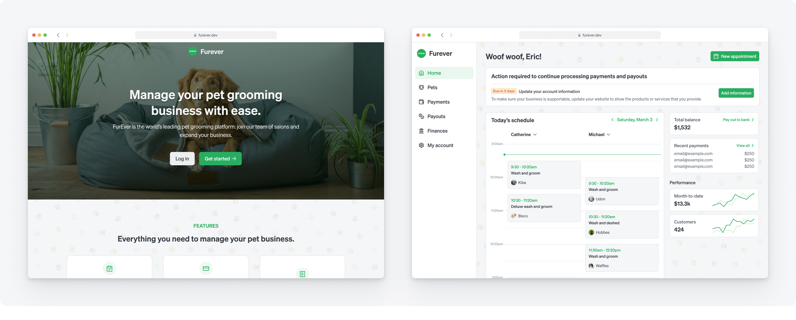

# FurEver: Stripe Connect embedded components demo

FurEver is a vertical SaaS grooming platform for pet salons to manage their e2e business operations. FurEver wants to provide access to Stripe products and UIs directly in their website, at a fraction of the engineering cost, using [Stripe Connect](https://stripe.com/connect) and [Stripe Connect embedded components](https://docs.stripe.com/connect/get-started-connect-embedded-components).

**See a live version on [furever.dev](https://furever.dev).**



## Features

FurEver showcases the integration between a platform's website, [Stripe Connect](https://stripe.com/connect), and [Stripe Connect embedded components](https://docs.stripe.com/connect/get-started-connect-embedded-components). Users sign up within the platform's website and through the process, a corresponding Stripe unified account is created with the following configuration:

- Stripe owns loss liability
- Platform owns pricing
- Stripe is onboarding owner
- The connected account has no access to the Stripe dashboard

The user will then onboard with Stripe via embedded onboarding. Thereafter, Connect embedded components will provide the UI surfaces for account management and dashboard UI elements with just a few lines of code. The demo website also uses the Stripe API to create test payments and payouts. This app also contains a basic authentication system.

FurEver makes use of the following [Connect embedded components](https://docs.stripe.com/connect/supported-embedded-components):

- `<ConnectOnboarding />` enables an embedded onboarding experience without redirecting users to Stripe hosted onboarding.
- `<ConnectPayments />` provides a list to display Stripe payments, refunds, and disputes. This also includes handling list filtering, pagination, and CSV exports.
- `<ConnectPayouts />` provides a list to display Stripe payouts and balance. This also includes handling list filtering, pagination, and CSV exports.
- `<ConnectAccountManagement />` allows users to edit their Stripe account settings without navigating to the Stripe dashboard.
- `<ConnectNotificationBanner />` displays a list of current and future risk requirements an account needs to resolve.
- `<ConnectDocuments />` displays a list of tax invoice documents.
- `<ConnectTaxSettings />` allows users to [set up Stripe Tax](https://docs.stripe.com/tax/set-up).
- `<ConnectTaxRegistrations />` allows users to control their tax compliance settings.

Additionally, the following preview components are also used:

- `<ConnectCapitalOverview />` **preview** allows users to check their eligibility for financing, get an overview of their in-progress financing, and access the reporting page to review paydown transactions.
- `<ConnectFinancialAccount />` **preview** renders a view of an individual [Financial Account](https://docs.stripe.com/api/treasury/financial_accounts)
- `<ConnectFinancialAccountTransactions />` **preview** provides a list of transactions associated with a financial account.
- `<ConnectIssuingCardsList />` **preview** provides a list of all the cards issued.

### Architecture

The web application is implemented as as full-stack application using Express, React, Typescript, and Material UI.

This demo is built with

- [Next.js](https://nextjs.org/)
- [Tailwind CSS](https://tailwindcss.com/)
- [shadcn/ui](https://ui.shadcn.com/)

To integrate Stripe Connect embedded components, check out our [documentation](https://docs.stripe.com/connect/get-started-connect-embedded-components).

1. [`hooks/useConnect.ts`](client/hooks/Connect.tsx) shows the client side integration with Connect embedded components.
2. [`api/account_session/route.ts`](server/routes/stripe.ts) shows the server request to `v1/account_sessions`.

## Requirements

You'll need a Stripe account to manage pet salon onboarding and payments:

- [Sign up for free](https://dashboard.stripe.com/register), then [enable Connect](https://dashboard.stripe.com/account/applications/settings) by filling in your Connect settings.
- Fill in the necessary information in the **Branding** section in [Connect settings](https://dashboard.stripe.com/test/settings/connect).

### Getting started

Install dependencies using npm (or yarn):

```
yarn
```

Copy the environment file and add your own [Stripe API keys](https://dashboard.stripe.com/account/apikeys):

```
cp .env.example .env
```

Install MongoDB Community Edition. Refer to the [official documentation](https://www.mongodb.com/docs/manual/tutorial/install-mongodb-on-os-x/). Then, run MongoDB:

```
brew tap mongodb/brew && brew update
brew install mongodb-community@7.0
brew services start mongodb-community@7.0
```

Run the app:

```
yarn dev
```

Go to `http://localhost:{process.env.PORT}` in your browser to start using the app.

To test events sent to your event handler, you can run this command in a separate terminal:

```
stripe listen --forward-to localhost:3000/api/webhooks
```

Then, trigger a test event with:

```
stripe trigger payment_intent.succeeded
```

## Preview components

By default, preview components are turned off in this repository. If you'd like to enable them, make sure to request access to them for your platforms in [the Stripe doc site](https://docs.stripe.com/connect/supported-embedded-components). You can then add this variable to the .env file to activate these components.

```
NEXT_PUBLIC_ENABLE_PREVIEW_COMPONENTS=1
```
